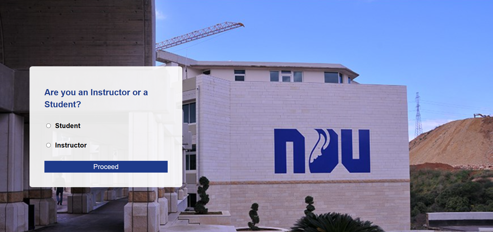
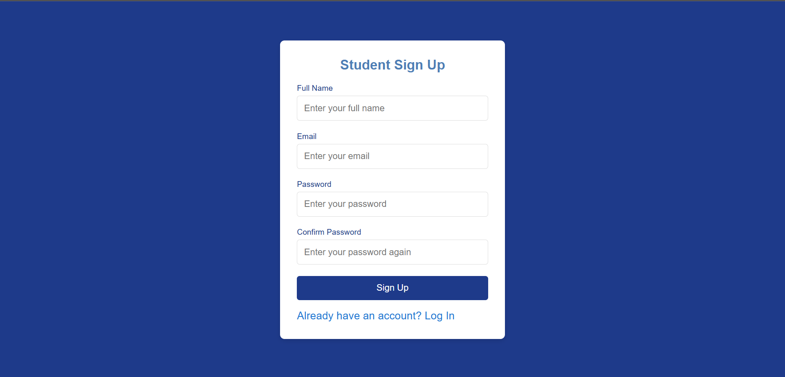
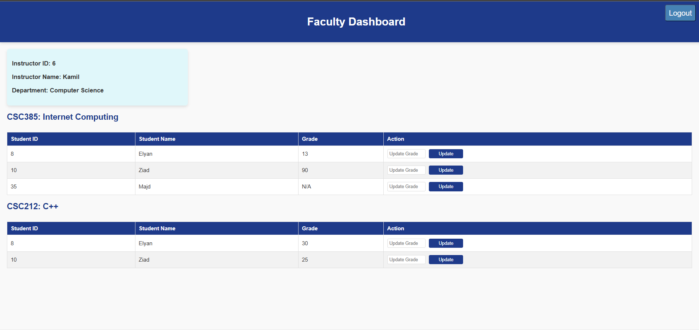
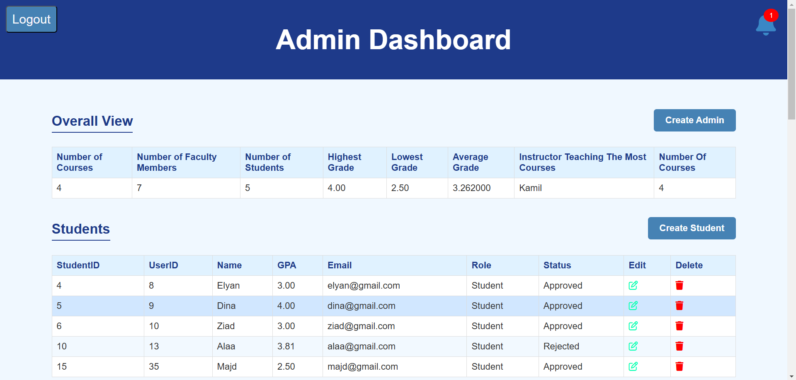
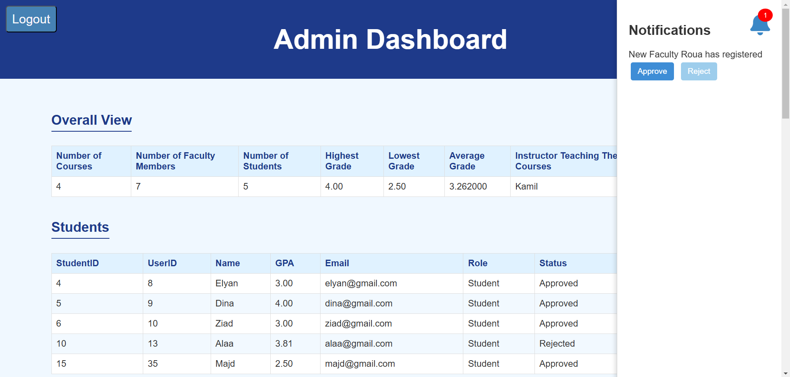
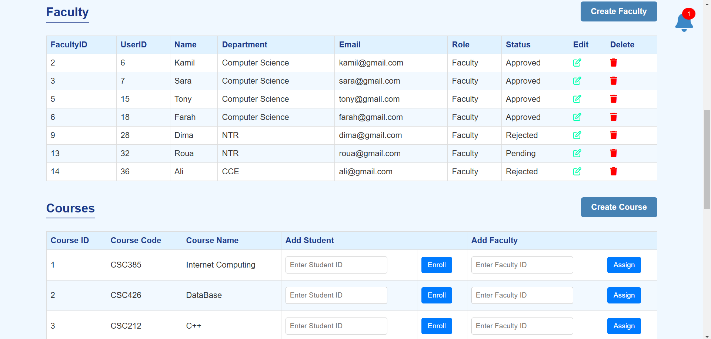
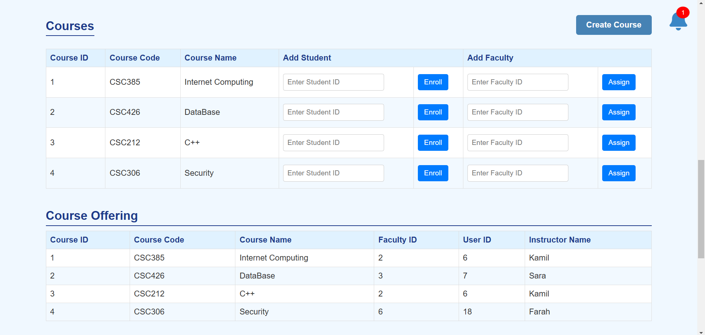
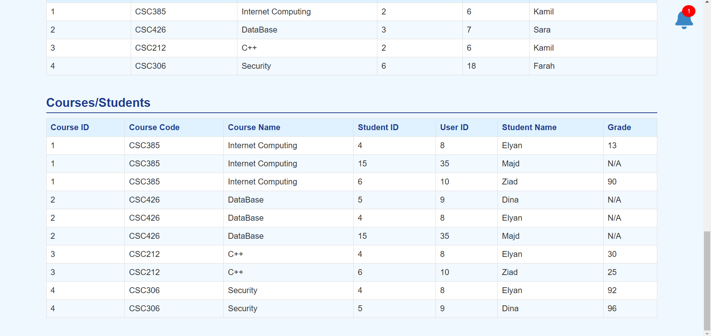
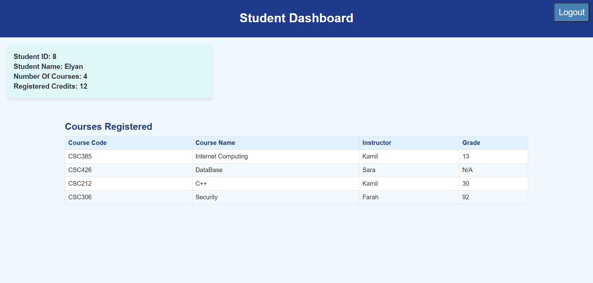

# School Database Management System

## Overview

This is a web-based School Database Management System built using PHP, MySQL (phpMyAdmin), and XAMPP. It includes role-based logins for administrators, faculty, and students, with AJAX for real-time updates.

## Features

- **Role-Based Authentication**: Users (Admin, Faculty, Student) are redirected to their respective dashboards after login.
- **Login & Signup Pages**:
  - Secure login system that determines user roles via the database.
  - Separate signup pages for students and faculty members.
  - Admin approval required for new registrations.
- **Admin Panel**:
  - View and manage students, faculty, and courses.
  - Approve or reject new registrations in real time via AJAX.
  - Create new students, faculty, and admins.
- **Faculty Dashboard**:
  - View assigned courses and students.
  - Update student grades.
- **Student Dashboard**:
  - View enrolled courses and grades.

## Setup Instructions

1. **Install XAMPP**: Download and install [XAMPP](https://www.apachefriends.org/index.html).
2. **Clone the Repository**:
   ```bash
   git clone <your-repository-url>
   cd School-Database-Management-System
   ```
3. **Move the Project to XAMPP htdocs**:
   - Copy the project folder to `C:\xampp\htdocs\`.
4. **Setup the Database**:
   - Open `phpMyAdmin` (`http://localhost/phpmyadmin/`).
   - Create a new database (e.g., `SchoolDatabase`).
   - Import `SchoolDatabase.sql` from the project.
5. **Configure the Database Connection**:
   - Open `config.php` and update database credentials if needed.
   - You may also need to modify the `getConnection` function in `db.php` to match your database name and port.
6. **Run the Project**:
   - Start Apache and MySQL from XAMPP Control Panel.
   - Open `http://localhost/SchoolDatabase/` in a browser.

## Screenshots

### Login Page
*This page allows users to log in and redirects them based on their role.*


### Signup Pages
*Separate signup pages for students and faculty, requiring admin approval.*







### Admin Dashboard
*Displays an overview of the system, including users, courses, and pending approvals.*











### Faculty Dashboard
*Shows faculty members their assigned courses and allows them to update student grades.*


### Student Dashboard
*Provides students with an overview of their registered courses and grades.*



